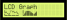
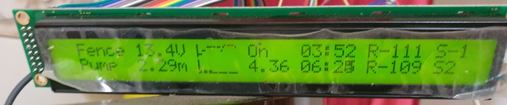

# LCDGraph  <!-- omit in toc -->

An Arduino library for drawing line graphs on alphanumeric displays using custom characters



This library uses custom characters to draw simple line graphs on Hitachi HD44780 based alphanumeric displays using the built in [LiquidCrystal](https://www.arduino.cc/en/Reference/LiquidCrystal) library. Other libraries can be used if needed for the likes of displays driven through I2C.

The x axis is always the data point while the y axis can be scaled as required, even after data has been entered.

## Table of Contents <!-- omit in toc -->
- [Connections](#connections)
- [Getting started](#getting-started)
  - [Installing the library](#installing-the-library)
  - [Including in your sketch](#including-in-your-sketch)
  - [Creating the `LiquidCrystal` and `LCDGraph` instances](#creating-the-liquidcrystal-and-lcdgraph-instances)
  - [Initialising the display and graph](#initialising-the-display-and-graph)
  - [Changing the styling and layout of the graph](#changing-the-styling-and-layout-of-the-graph)
  - [Adding data to the graph](#adding-data-to-the-graph)
  - [Drawing the graph on the display](#drawing-the-graph-on-the-display)
  - [Automatic scaling of the y axis](#automatic-scaling-of-the-y-axis)
- [Use with other LCD libraries and I2C displays](#use-with-other-lcd-libraries-and-i2c-displays)
- [API](#api)
- [Examples](#examples)

# Connections
All interfacing to the lcd is handled by the built in Arduino `LiquidCrystal` library, meaning that the `LCDGraph` library has no extra requirements on top of the `LiquidCrystal` library for how the display is connected.

# Getting started
## Installing the library
Search for *LCDGraph* in the libraries manager or copy this folder into the Arduino library folder. You may want to restart the Arduino IDE if you are using it to get syntax highlighting to update.

## Including in your sketch
Add these lines to the top of your sketch:
```c++
// Libraries to include
#include <LiquidCrystal.h>
#include <LCDGraph.h>
```

## Creating the `LiquidCrystal` and `LCDGraph` instances
Initialise the `LiquidCrystal` library as normal. Also add a constructor for the `LCDGraph` library. In this case, we are going to call the lcd `lcd` and our graph `graph`.
```c++
// Constructors
LiquidCrystal lcd(12, 11, 5, 4, 3, 2);
LCDGraph<uint8_t> graph(8, 1, 0); // 8 character wide graph, 1 char high, starting at custom char # 0 in the lcd ram.
```
The `<uint8_t>` in the `LCDGraph` constructor tells the library we want it to store and display bytes. If you need a larger range or floating point, you can change this to another data type such as `<int>`, `<long>` or `<float>`.

## Initialising the display and graph
In the `setup` function, add these lines, changing the numbers in `lcd.begin` to suit the dimensions of the display you are using:
```c++
// Set up the lcd
lcd.begin(20, 4);
graph.begin(&lcd);
```

## Changing the styling and layout of the graph
Say we want the graph to not be filled, the y axis minimum to be 10 and the maximum to be 20. In this case you can change a few attributes:
```c++
graph.filled = false;
graph.yMin = 10; // We specified 
graph.yMax = 20;
```

## Adding data to the graph
For every data point to add, call `graph.add`. As we specified that the library will be working with bytes in the constructor, the number we give it must be between 0 and 255.
```c++
graph.add(10);
graph.add(2);
graph.add(12);
graph.add(15);
graph.add(18);
graph.add(20);
graph.add(50);
```

## Drawing the graph on the display
We have added data to the graph, but it does not show on the screen yet. To make it be displayed, we need to convert the data into custom characters and send them to the custom character registers in the display. To do this, call `graph.setRegisters`, followed by `graph.display` to draw them on the display.
```c++
graph.setRegisters(); // Send the stored data to the display as custom characters.
graph.display(0, 1); // Draw the graph starting in the first column, second row.
```
Once the graph has been drawn, I have found that calling `setRegisters` will also update what is displayed.

## Automatic scaling of the y axis
The data in the example above goes outside the range of [10, 20]. We can automatically rescale the y axis to fit all data by using:
```c++
graph.autorescale(false); // Rescale the y axis, do not force it to go through 0
graph.setRegisters();
```

# Use with other LCD libraries and I2C displays
Templates can be used to specify the library used to drive the display similarly to the data format used. This will default to the built in `LiquidCrystal` library if not specified.

Any library object given should have many of the same methods and behaviours as `LiquidCrystal`.

The [`LiquidCrystal_I2C`](https://github.com/johnrickman/LiquidCrystal_I2C) library is used in the [I2CDisplay](examples/I2CDisplay/I2CDisplay.ino) example. The following is a short extract:
```c++
#include <Wire.h> 
#include <LiquidCrystal_I2C.h>
#include <LCDGraph.h>

// ...

LiquidCrystal_I2C lcd(LCD_ADDRESS, LCD_COLS, LCD_ROWS);
LCDGraph<float, LiquidCrystal_I2C> graph(8, 0); // We want to store floats in this case

// ...

```

# API
The are a few more methods and attributes that were not discussed above. Information on them can be found in the API documentation.
See [API.md](extras/API.md) for documentation on the publically available methods and attributes.

# Examples
For examples, see the [examples](examples) folder.


Just to prove that it runs, here is a photo of an unfinished project using it:

